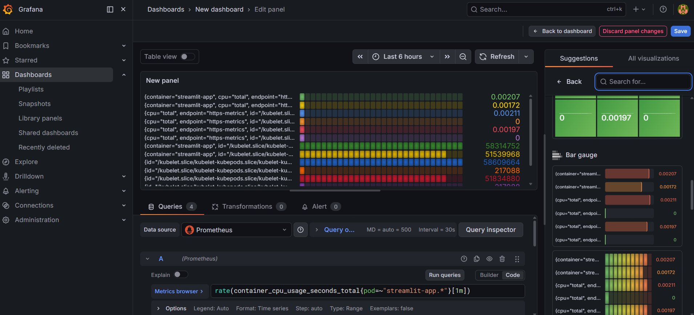

# AegisOps — Kubernetes Monitoring Stack

> A full-stack observability pipeline built with **Streamlit**, **FastAPI**, **Prometheus**, and **Grafana**, deployed on **Kubernetes**.

---

## 📸 Grafana Dashboard



*Panel: `rate(container_cpu_usage_seconds_total{pod=~"streamlit-app.*"}[1m])` — live CPU usage across Streamlit pods scraped via Prometheus.*

---

## 🗂️ Project Structure

```
.
├── app.py                   # Streamlit app with Prometheus metrics
├── main.py                  # FastAPI task management service
├── Dockerfile               # Container image for the Streamlit app
├── deployment.yaml          # Kubernetes Deployment (2 replicas)
├── service.yaml             # Kubernetes NodePort Service (port 30080)
└── prometheus-config.yaml   # Prometheus ConfigMap for pod scraping
```

---

## 🧩 Components

### 1. Streamlit App (`app.py`)
- Serves the main UI at port `8501`
- Exposes a `streamlit_requests_total` Prometheus counter
- Metrics visible via the **"Expose Metrics"** button

### 2. FastAPI Service (`main.py`)
- REST API for task management
- `POST /tasks` — create a task
- `GET /tasks` — list all tasks

### 3. Dockerfile
- Base image: `python:3.11-slim`
- Installs Streamlit and runs `app.py` on `0.0.0.0:8501`

---

## ☸️ Kubernetes Setup

### Deploy the App

```bash
kubectl apply -f deployment.yaml
kubectl apply -f service.yaml
```

The app will be accessible at:
```
http://<node-ip>:30080
```

### Apply Prometheus Config

```bash
kubectl apply -f prometheus-config.yaml
```

This ConfigMap configures Prometheus to auto-discover and scrape all pods via `kubernetes_sd_configs`.

---

## 📊 Prometheus & Grafana

### Prometheus
Prometheus is configured to scrape Kubernetes pods automatically.

Verify targets are up:
```
http://localhost:9090/targets
```

### Grafana — Add CPU Panel

1. Open Grafana → **Dashboards → New Dashboard → Add Visualization**
2. Select **Prometheus** as the data source
3. In the query editor (**Code** mode), enter:

```promql
rate(container_cpu_usage_seconds_total{pod=~"streamlit-app.*"}[1m])
```

4. Set visualization type to **Time series**
5. Set unit to **Percent (0–100)** under *Standard options*
6. Click **Apply** → **Save dashboard**

---

## 🐳 Docker

### Build & Push Image

```bash
docker build -t moinakdey17/streamlit-app:latest .
docker push moinakdey17/streamlit-app:latest
```

---

## ✅ Quickstart

```bash
# 1. Deploy to Kubernetes
kubectl apply -f deployment.yaml
kubectl apply -f service.yaml
kubectl apply -f prometheus-config.yaml

# 2. Forward Grafana port (if running in-cluster)
kubectl port-forward svc/grafana 3000:3000

# 3. Forward Prometheus port
kubectl port-forward svc/prometheus-server 9090:9090

# 4. Open Grafana
open http://localhost:3000
```

---

## 🛠️ Tech Stack

| Layer | Tool |
|---|---|
| App UI | Streamlit |
| Backend API | FastAPI |
| Metrics | Prometheus (`prometheus_client`) |
| Visualization | Grafana |
| Container | Docker |
| Orchestration | Kubernetes |

---

## 📝 License

MIT — feel free to use and adapt.
