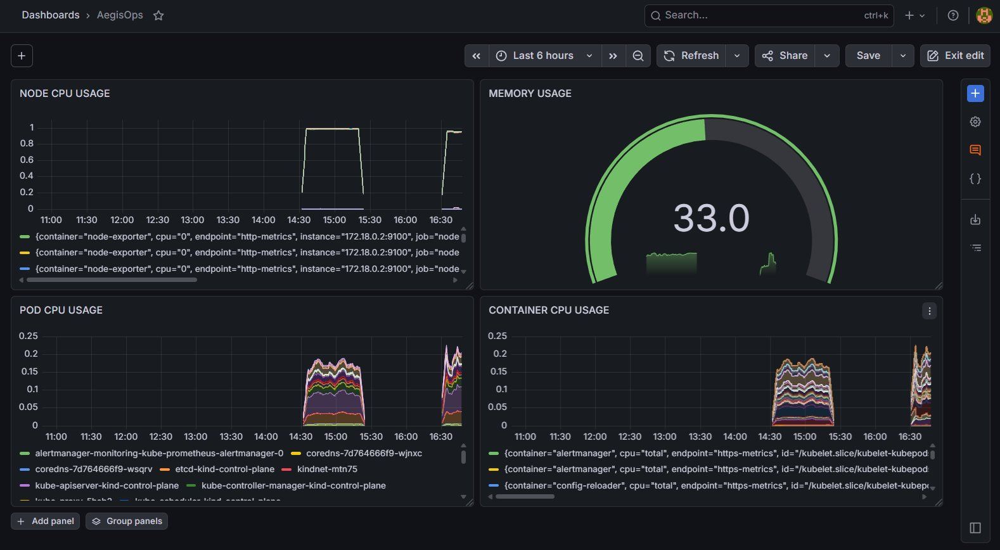
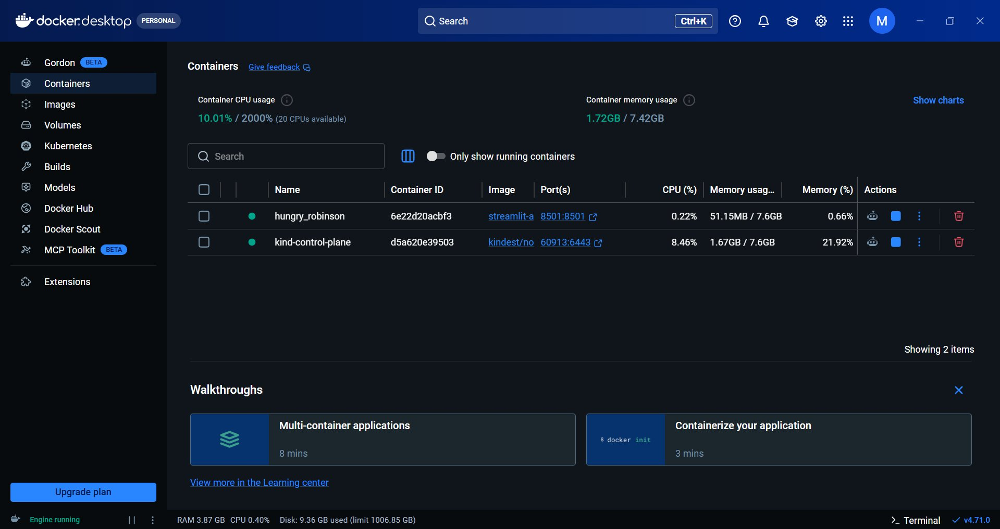
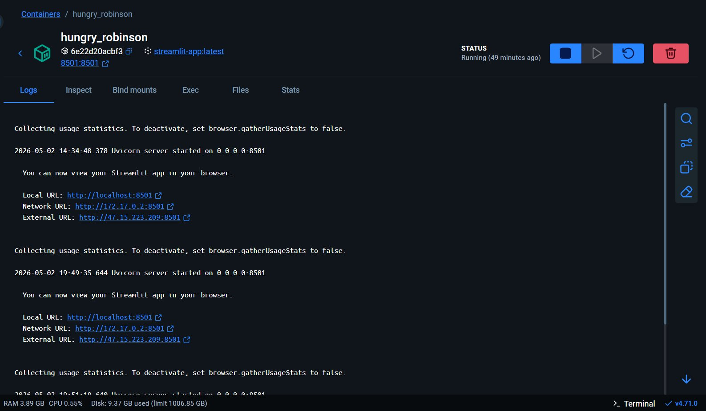

# AegisOps — Kubernetes Monitoring Stack

> A full-stack observability pipeline built with **Streamlit**, **FastAPI**, **Prometheus**, and **Grafana**, deployed on **Kubernetes**.

---

## 📸 Screenshots

### AegisOps Grafana Dashboard — Full Monitoring View


*AegisOps dashboard showing Node CPU Usage, Memory Usage (gauge at 33%), Pod CPU Usage, and Container CPU Usage — all scraped via Prometheus from the Kubernetes cluster.*

---

### Grafana Dashboard — Container CPU (Bar Gauge)


*Panel: `rate(container_cpu_usage_seconds_total{pod=~"streamlit-app.*"}[1m])` — live CPU usage across Streamlit pods scraped via Prometheus.*

---

### Docker Desktop — Running Containers


*Two active containers: `hungry_robinson` (Streamlit app on port 8501) and `kind-control-plane` (Kubernetes cluster node). Total resource usage: CPU 10.01%, Memory 1.72 GB / 7.42 GB.*

---

### Docker Desktop — Streamlit Container Logs


*Container `hungry_robinson` running `streamlit-app:latest`. Uvicorn server started on `0.0.0.0:8501`. Accessible at `http://localhost:8501`.*

---

## 🗂️ Project Structure

```
.
├── app.py                   # Streamlit app with Prometheus metrics
├── main.py                  # FastAPI task management service
├── Dockerfile               # Container image for the Streamlit app
├── deployment.yaml          # Kubernetes Deployment (2 replicas)
├── service.yaml             # Kubernetes NodePort Service (port 30080)
└── prometheus-config.yaml   # Prometheus ConfigMap for pod scraping
```

---

## 🧩 Components

### 1. Streamlit App (`app.py`)
- Serves the main UI at port `8501`
- Exposes a `streamlit_requests_total` Prometheus counter
- Metrics visible via the **"Expose Metrics"** button

### 2. FastAPI Service (`main.py`)
- REST API for task management
- `POST /tasks` — create a task
- `GET /tasks` — list all tasks

### 3. Dockerfile
- Base image: `python:3.11-slim`
- Installs Streamlit and runs `app.py` on `0.0.0.0:8501`

---

## ☸️ Kubernetes Setup

### Deploy the App

```bash
kubectl apply -f deployment.yaml
kubectl apply -f service.yaml
```

The app will be accessible at:
```
http://<node-ip>:30080
```

### Apply Prometheus Config

```bash
kubectl apply -f prometheus-config.yaml
```

This ConfigMap configures Prometheus to auto-discover and scrape all pods via `kubernetes_sd_configs`.

---

## 📊 Prometheus & Grafana

### Prometheus
Prometheus is configured to scrape Kubernetes pods automatically.

Verify targets are up:
```
http://localhost:9090/targets
```

### Grafana — Dashboard Panels & PromQL Queries

The **AegisOps** dashboard consists of 4 panels. Add each as a separate visualization in Grafana using the queries below:

---

#### 📈 Panel 1 — Node CPU Usage
> Visualization: **Time series**

```promql
rate(node_cpu_seconds_total[5m])
```
Shows CPU usage across all modes (user, system, idle, etc.) for each node.

---

#### 🟢 Panel 2 — Memory Usage
> Visualization: **Gauge**

```promql
100 * (1 - (node_memory_MemAvailable_bytes / node_memory_MemTotal_bytes))
```
Displays memory utilization as a percentage. Set unit to `Percent (0–100)`, threshold at 80% (yellow) and 90% (red).

---

#### 📊 Panel 3 — Pod CPU Usage
> Visualization: **Time series**

```promql
sum by (pod)(rate(container_cpu_usage_seconds_total[5m]))
```
Aggregates CPU usage per pod — useful for spotting which pod is consuming the most resources.

---

#### 📊 Panel 4 — Container CPU Usage
> Visualization: **Time series**

```promql
rate(container_cpu_usage_seconds_total[5m])
```
Per-container CPU usage breakdown — more granular than pod-level view.

---

---

## 🐳 Docker

### Build & Push Image

```bash
docker build -t moinakdey17/streamlit-app:latest .
docker push moinakdey17/streamlit-app:latest
```

---

## ✅ Quickstart

```bash
# 1. Deploy to Kubernetes
kubectl apply -f deployment.yaml
kubectl apply -f service.yaml
kubectl apply -f prometheus-config.yaml

# 2. Forward Grafana port (if running in-cluster)
kubectl port-forward svc/grafana 3000:3000

# 3. Forward Prometheus port
kubectl port-forward svc/prometheus-server 9090:9090

# 4. Open Grafana
open http://localhost:3000
```

---

## 🛠️ Tech Stack

| Layer | Tool |
|---|---|
| App UI | Streamlit |
| Backend API | FastAPI |
| Metrics | Prometheus (`prometheus_client`) |
| Visualization | Grafana |
| Container | Docker |
| Orchestration | Kubernetes |

---

## 📝 License

MIT — feel free to use and adapt.